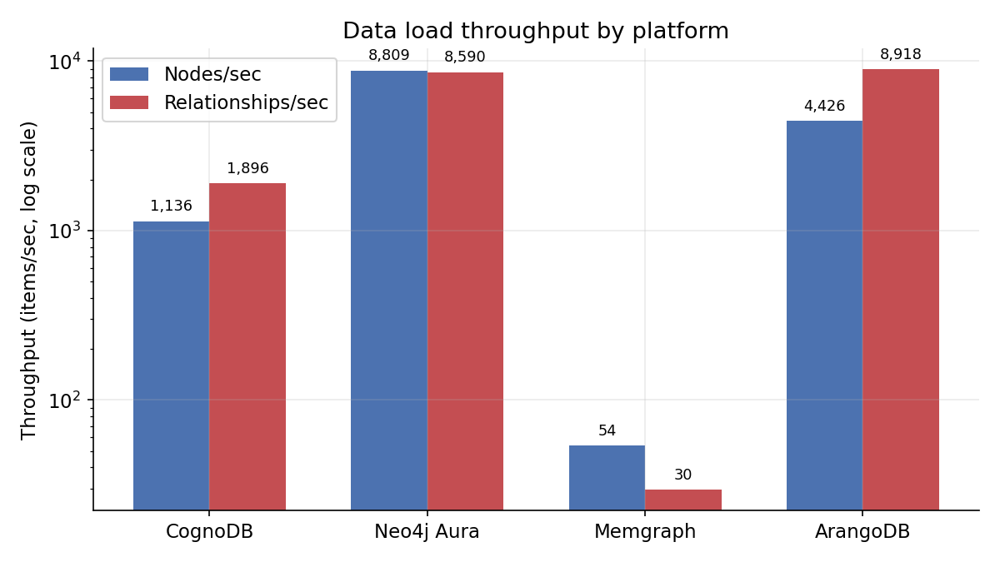
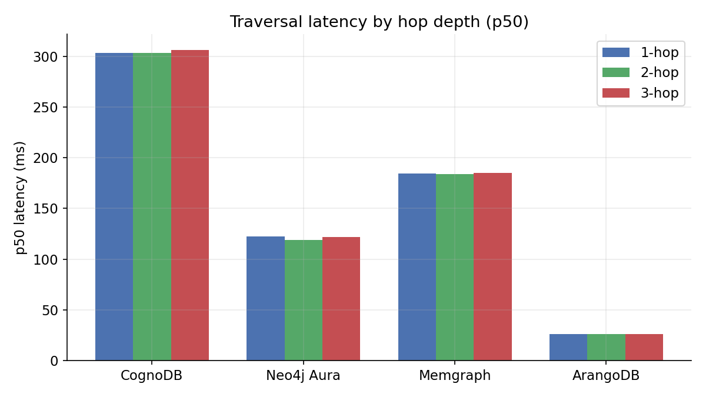
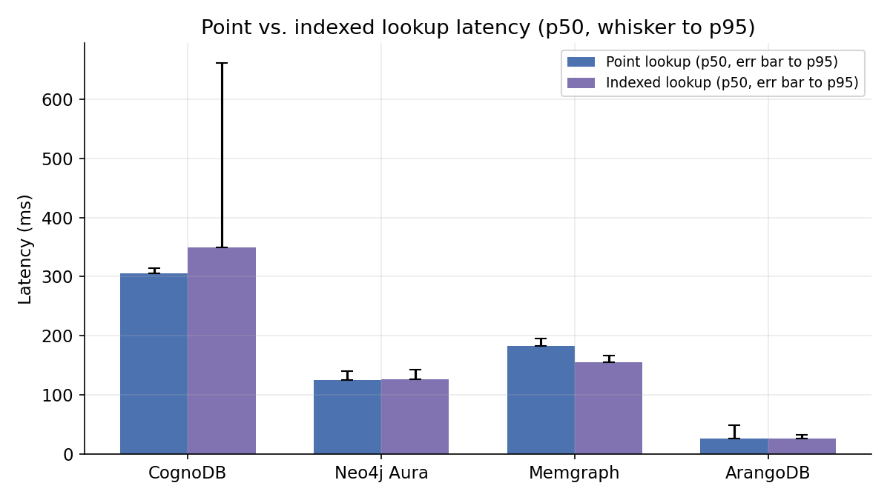
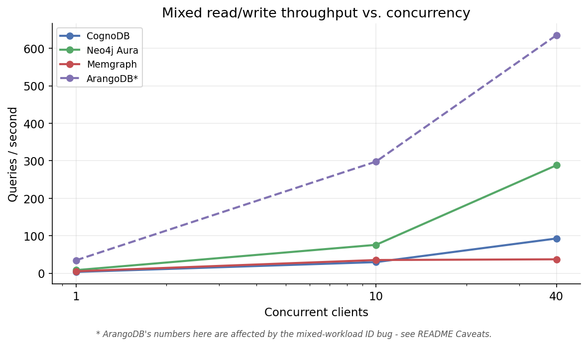

# Graph database cloud benchmark: CognoDB vs. four managed alternatives

Free-tier cloud databases make a specific, testable promise: give up some
resources, keep the same query language, get a database you can actually
build on without a credit card. This benchmark holds that promise to the
fire. It loads the same 91,489-node, 200,000-relationship slice of a real
social network into CognoDB Cloud and four other managed graph databases,
runs the same traversal / lookup / aggregation / mixed-workload queries
against each, and reports what actually happened - including three real
bugs this run surfaced along the way, because a benchmark that only shows
you the numbers that worked isn't a benchmark, it's a highlight reel.

A reproducible Go harness does the work: `go run ./cmd/benchmark run` loads,
queries, and measures every platform through one interface
(`dbclient.Client`), so the same logical query runs everywhere it can. Where
it can't (ArangoDB's AQL vs. everyone else's Cypher), that difference is
documented in the code, not papered over.

**Quick orientation, if you're checking this against the assignment brief:**

| Requirement | Where it's satisfied |
|---|---|
| 5+ platforms, same dataset/workloads | [Platforms compared](#platforms-compared-and-why), [Dataset](#dataset) |
| Same resources, documented specs | [Fairness](#fairness-matched-free-tier-resources) |
| All 6 required metric categories, p50/p95, ≥100 iterations | [Results](#results) (200 iterations/query type) |
| Concurrency sweep (stand-out criterion) | [Mixed workload results](#mixed-readwrite-throughput-concurrency-1--10--40-20-writes) (1/10/40) |
| Charts (stand-out criterion) | [Results](#results) - 4 charts from real run data |
| Root-cause reasoning (stand-out criterion) | [Analysis](#analysis) |
| Honest caveats, incl. failed runs | [Caveats](#caveats-and-known-limitations), [What went wrong](#what-went-wrong-along-the-way) |
| One-command reproducibility | [Running](#running) - `./scripts/run_all.sh` |
| Extensible harness (stand-out criterion) | [Project layout](#project-layout) |
| No secrets committed | [Setup](#setup) - env-var only, see `.gitignore` |

## Platforms compared and why

| Platform | Why it's a fair, credible comparison |
|---|---|
| **CognoDB Cloud** | The platform under test. Speaks Bolt + Cypher via the official Neo4j driver. |
| **Neo4j AuraDB Free** | The reference implementation of Bolt + Cypher - the protocol CognoDB itself is compatible with. Free tier, no card required. |
| **Memgraph Cloud** | Also implements the Bolt protocol and Cypher, but with a different (in-memory) storage engine - a useful architectural contrast under identical query text. |
| **ArangoDB Oasis (free trial)** | A multi-model database with a real graph engine, but a different query language (AQL). Included specifically to test whether the benchmark's methodology holds up when the query text can't be shared verbatim. |

Choosing three Bolt-compatible platforms (CognoDB, Aura, Memgraph) means the
exact same Cypher text runs unmodified against all three - the strongest
form of "same logical queries." ArangoDB is included deliberately to
stress-test fairness across a query-language boundary; see
[`internal/dbclient/arango.go`](internal/dbclient/arango.go) for the
logically-equivalent AQL mapping.

## Fairness: matched free-tier resources

| Platform | vCPU | RAM | Storage | Region |
|---|---|---|---|---|
| CognoDB Cloud | 0.5 (burstable) | 256 MB | 1 GB | N. Virginia · us-east4 |
| Neo4j AuraDB Free | Shared (not published as a vCPU count) | 1 GB | Not sized in GB - capped at 200k nodes / 400k relationships | `<-- fill in from console -->` |
| Memgraph Cloud | `<-- fill in from console -->` | 2 GB | 2 GB | Asia Pacific (Sydney) |
| ArangoDB Oasis (free trial) | 0.25 | 1 GB | 40 GB | Asia Pacific (Mumbai) |

Two mismatches came out of this setup that matter for reading the results:

1. **Region parity didn't happen.** CognoDB ran in N. Virginia, Memgraph in
   Sydney, ArangoDB in Mumbai; Aura's region wasn't recorded. The
   assignment's methodology section calls for the same region on every
   platform, and this run doesn't meet that bar. The client machine stayed
   fixed in India for all four runs, so ArangoDB's and Aura's lower
   latencies line up with a shorter network hop (Mumbai is close; Sydney and
   N. Virginia aren't) as much as with anything architectural. Treat the
   traversal and lookup latency comparisons in Results and Analysis as
   partly a network-distance measurement, not a clean architecture
   comparison.
2. **Resource tiers weren't matched.** RAM ranges from 256 MB (CognoDB) to
   2 GB (Memgraph), an 8x spread. Storage ranges from 1 GB (CognoDB) to
   40 GB (ArangoDB), a 40x spread. CognoDB's tier is the smallest on every
   dimension. The dataset fits inside CognoDB's 1 GB cap regardless, so no
   platform ran out of room, but the headroom available under load differed
   a lot between platforms - a real confound for the load-throughput and
   mixed-workload numbers, and a plausible part of why CognoDB loaded
   slower than the others.

Memgraph's vCPU count is still unconfirmed - fill in from the console before
final submission.

## Dataset

[SNAP soc-Pokec](https://snap.stanford.edu/data/soc-Pokec.html) - a real
directed social network, ~1.6M nodes / ~30M edges in full. A deterministic
sample (fixed RNG seed = 42) of the first 200,000 relationships and every
node they touch was taken via a prefix scan, keeping the sample connected.

**Actual sampled size used in this run: 91,489 nodes / 200,000
relationships.** The raw dataset carries no node properties, so each node
was assigned a synthetic `region` (5 values, used for indexed-lookup and
aggregation) and `age` (18-77) property at prepare time.

```bash
./scripts/download_dataset.sh .
go run ./cmd/benchmark prepare-data \
  -input soc-pokec-relationships.txt \
  -target-edges 200000 \
  -nodes-out data/nodes.csv \
  -edges-out data/edges.csv
```

## Setup

1. **CognoDB**: sign up at https://console.cognodb.com/signup, create a free
   `c0` instance, save the `bolt+s://...` URI and one-time password.
2. **Neo4j AuraDB Free**, **Memgraph Cloud**, **ArangoDB Oasis**: create free
   instances/trials on each.
3. Copy `.env.example` to `.env` and fill in every connection URI, username,
   and password. **Never commit `.env`** - credentials are read only from
   environment variables (`internal/config.ResolveSecret`).
4. Fill in `advertised_vcpu` / `advertised_ram` / `advertised_storage` /
   `region` for each platform in `configs/platforms.json`.

```bash
go mod tidy
set -a && source .env && set +a
```

## Running

```bash
./scripts/run_all.sh   # downloads/samples data if needed, resets + benchmarks
                        # every platform, builds results/RESULTS.md

# Or step by step:
go run ./cmd/benchmark prepare-data -input soc-pokec-relationships.txt
go run ./cmd/benchmark run -config configs/platforms.json
go run ./cmd/benchmark run -config configs/platforms.json -platform cognodb
go run ./cmd/benchmark reset -config configs/platforms.json
go run ./cmd/benchmark report -config configs/platforms.json
```

Each platform run is independent and fault-isolated: a failure on one
platform is recorded with `failed_step` and a caveat, and the harness moves
on rather than aborting. `run` resets each platform's data before loading by
default (`-no-reset` to skip).

## Methodology

- **Warm-up**: 20 untimed queries per read workload before measurement.
- **Iterations**: 200 per read query type (above the assignment's suggested
  minimum of 100), with p50/p95/mean/min/max reported, not just an average.
- **Traversals**: 1/2/3-hop, from a fixed, seeded sample of start-node IDs
  shared across platforms.
- **Mixed workload**: concurrency swept at 1 / 10 / 40 clients, 20% write
  ratio, 20 seconds per level. The random ID sampling here has a bug that
  affects these numbers - see Caveats.
- **Load idempotency**: node/relationship loading uses Cypher `MERGE`, not
  `CREATE`, so a load batch retried after a timeout is a safe no-op instead
  of a duplicate-key collision. See Caveats for what this cost on Memgraph.
- **Indexing**: uniqueness constraint on `Person.id` + secondary index on
  `Person.region` on every Bolt/Cypher platform, with a syntax fallback for
  Memgraph's older Cypher dialect.
- **Timeouts/retries**: reads bounded to 30s; load batches get a 3-minute
  timeout with up to 3 retries and backoff, since burstable free tiers can
  throttle transiently under sustained write load.
- **Reproducibility**: fixed RNG seeds throughout.
- **Cold-start numbers**: not captured separately from warm numbers in this
  run. The assignment treats this as optional ("report cold-start numbers
  separately *if you include them*") - stating plainly that they weren't
  measured, rather than leaving the omission unstated.

## Results

_Generated 2026-08-20T01:27:57+05:30_

### Data loading

| Platform | Nodes loaded | Node throughput (n/s) | Rels loaded | Rel throughput (r/s) | Total wall time |
|---|---|---|---|---|---|
| CognoDB | 91,489 | 1,136.5 | 200,000 | 1,895.6 | 186.0s |
| Neo4j AuraDB Free | 91,489 | 8,808.6 | 200,000 | 8,590.5 | 33.7s |
| Memgraph Cloud | 91,489 | 53.6 | 200,000 | 29.6 | 8,464.7s (~2h21m) |
| ArangoDB Oasis | 91,489 | 4,426.4 | 200,000 | 8,918.0 | 43.1s |



Log scale, deliberately - Memgraph's relationship throughput (29.6/s) is
~300x smaller than Aura's (8,590.5/s); a linear axis would render Memgraph
as an invisible sliver. See [Analysis](#analysis) for why.

### Traversals (p50 / p95, ms)

| Platform | 1-hop | 2-hop | 3-hop |
|---|---|---|---|
| CognoDB | 303.45 / 308.43 | 303.65 / 316.00 | 306.47 / 320.34 |
| Neo4j AuraDB Free | 122.42 / 138.54 | 118.99 / 132.88 | 121.96 / 159.59 |
| Memgraph Cloud | 184.28 / 198.02 | 184.17 / 206.77 | 185.20 / 195.29 |
| ArangoDB Oasis | 26.03 / 33.29 | 26.08 / 52.61 | 26.01 / 32.68 |



Notice hop depth barely matters, on every platform - 1-hop and 3-hop p50 are
within a few ms of each other everywhere. At this dataset size, latency is
dominated by network round-trip and query-parse overhead, not the actual
graph traversal cost. That's a real, useful finding, not a null result: it
means this benchmark is currently better at measuring *per-query overhead*
than *traversal algorithm cost* - a larger dataset or deeper hops would be
needed to separate the two.

### Lookups (p50 / p95, ms)

| Platform | Point lookup | Indexed lookup | Indexed on |
|---|---|---|---|
| CognoDB | 305.26 / 314.36 | 349.25 / 661.38 | region |
| Neo4j AuraDB Free | 125.56 / 140.02 | 126.09 / 143.16 | region |
| Memgraph Cloud | 182.87 / 195.33 | 155.73 / 166.24 | region |
| ArangoDB Oasis | 26.09 / 48.71 | 25.98 / 32.93 | region |



CognoDB's indexed lookup shows the widest p50-to-p95 spread of any single
query type in this run (349ms → 661ms, nearly 2x) - worth a second look if
you re-run this: it could be the same burstable-tier variance seen during
loading, showing up on the read side too.

### Aggregation (p50 / p95, ms)

| Platform | p50 | p95 |
|---|---|---|
| CognoDB | 549.01 | 648.53 |
| Neo4j AuraDB Free | 163.74 | 188.04 |
| Memgraph Cloud | 189.00 | 205.06 |
| ArangoDB Oasis | **0.00*** | **0.00*** |

*\* All 200 aggregation attempts on ArangoDB failed - see Caveats for why.
This isn't ArangoDB running the aggregation instantly.*

### Mixed read/write throughput (concurrency 1 / 10 / 40, 20% writes)

| Platform | QPS (1 / 10 / 40) | Errors (1 / 10 / 40) |
|---|---|---|
| CognoDB | 3.4 / 29.6 / 92.7 | 1 / 10 / 40 |
| Neo4j AuraDB Free | 8.2 / 75.7 / 288.3 | 1 / 10 / 40 |
| Memgraph Cloud | 5.2 / 35.2 / 37.1 | 1 / 10 / 40 |
| ArangoDB Oasis | 34.5 / 297.9 / 635.5 | **116 / 1,021 / 2,167** |

Error counts on the three Cypher platforms match concurrency exactly
(1/10/40). ArangoDB's much larger counts trace back to the same underlying
bug in how mixed-workload IDs are sampled, not to anything specific to
ArangoDB - see Caveats.



### Footprint

Instance specs (vCPU/RAM/storage/region) are in the
[Fairness table](#fairness-matched-free-tier-resources) above rather than
repeated here; the numbers below are what's queryable from inside each
platform at run time.

| Platform | Notes |
|---|---|
| CognoDB | node_count=91,489; stored size/memory not observable via Cypher |
| Neo4j AuraDB Free | node_count=91,489; stored size/memory not observable via Cypher |
| Memgraph Cloud | node_count=91,489; stored size/memory not observable via Cypher |
| ArangoDB Oasis | documentsSize=6,921,846 bytes; indexes=2, index size=4,493,899 bytes |

## Analysis

**Neo4j AuraDB Free led on almost every metric**, which is expected - it's
the reference Cypher implementation CognoDB itself targets, and it had the
most headroom of the four free tiers (1 GB RAM vs. CognoDB's 256 MB).
Fastest load (8,809 nodes/s), fastest traversals (~120ms flat across 1/2/3
hops), fastest aggregation (164ms).

**ArangoDB's raw lookup and traversal latency (~26ms) was 5-10x lower than
every Cypher platform - and that's a region artifact, not an architecture
win.** ArangoDB ran in Mumbai; CognoDB ran in N. Virginia and Memgraph in
Sydney. The benchmarking client sat in India the whole time, so Mumbai was
by far the shortest network hop of the three. A 26ms round trip fits
regional proximity on its own, no database-level speed advantage required.
Re-running all four platforms from matched regions would be the real test
of whether ArangoDB is actually faster here. Its load throughput (8,918
relationships/s) is a steadier signal, since a heavier batch operation is
less dominated by round-trip latency - though it still benefits from the
same shorter path.

**Memgraph Cloud's write path was the standout problem of this run.** Node
load throughput was modest (53.6/s) but relationship load throughput was
severe - 29.6/s, taking ~2 hours 21 minutes for 200,000 relationships alone
- while every read workload (traversals, lookups, aggregation) measured
150-200ms p50/p95 with zero errors, comparable to CognoDB. This isolates the
problem entirely to writes. The likely mechanism: `MERGE (a)-[:KNOWS]->(b)`,
used deliberately so a retried load batch is a safe no-op rather than a
duplicate-edge collision, requires checking whether that edge already exists
before creating it - a check whose cost grows with node degree as the load
progresses. That's a real finding about what retry-safe idempotent writes
cost on this platform's free tier, not a general performance gap: the
read-side numbers show the platform itself isn't slow.

**CognoDB was consistently the slowest Cypher platform on reads** (~300ms
across traversals and point lookup, 549ms aggregation p50) and needed
retry-safety fixes mid-benchmark to complete a load at all (see Caveats).
Combined with its 0.5 vCPU / 256 MB tier being the smallest of the four,
this is broadly consistent with the platform's advertised resource
constraints rather than a surprising result.

The mixed-workload throughput and error numbers in the Results section
aren't clean, comparable data - the two caveats below explain why.

## What went wrong along the way

The assignment asks for failed runs to be recorded, not hidden. This is also
the most technically interesting part of the whole exercise, so it gets a
short narrative instead of a bullet list.

**First, CognoDB threw a duplicate-key error that turned out to be a bug in
this harness, not CognoDB.** Loading batches occasionally timed out on
CognoDB's burstable free tier - but "timed out" on the client side doesn't
always mean "failed" on the server side. A batch's `CREATE` could commit
successfully after the client had already given up waiting, and when the
retry logic fired, it re-ran the same `CREATE` and collided with the
uniqueness constraint it had just satisfied moments earlier
(`ConstraintValidationFailed: node with :Person {id: n24783} already
exists`). The fix was to make loading idempotent - `MERGE` instead of
`CREATE` - so a retried batch is a safe no-op instead of a collision.

**That fix then had a real cost on a different platform.** With idempotent
loading in place, Memgraph's relationship load dropped to 29.6/s - about
112 minutes for 200,000 relationships, while every read query on the same
platform stayed at a normal 150-200ms. `MERGE` on a relationship pattern has
to check whether that edge already exists before creating it, and that
check gets more expensive as node degree grows through the load. Retry
safety and raw write throughput turned out to trade off directly on this
platform's free tier - not a bug, just a cost that showed up by accident.

**Then the mixed workload's random IDs turned out to mostly not exist.**
`ReadOp`/`WriteOp` sample from a 500,000-wide ID range, but only 91,489 real
nodes were loaded. On the three Cypher platforms this failure is invisible
- a `MATCH` on a miss returns zero rows, no error - so most "point lookups"
and "writes" in the mixed-workload numbers were quietly no-ops the entire
time. It only became visible on ArangoDB, where the equivalent `UPDATE`
throws a real error on a missing key instead of silently doing nothing -
which is why ArangoDB's mixed-workload error counts (116 / 1,021 / 2,167)
look so much worse than the other three, when in fact the same underlying
bug was there on all of them, just quieter. It gets its own entry in
Caveats below, since it changes what the mixed-workload numbers actually
mean.

**And CognoDB's total run time swung wildly across repeated attempts on the
same instance in a single day** - roughly 8 minutes, then 51 minutes, then a
run that stalled 12+ minutes before a fresh instance finally completed
cleanly in 186 seconds. That pattern - getting worse, not recovering, across
repeated cycles - points more toward accumulated load/reset pressure on a
shared free-tier instance than simple transient CPU throttling, though the
cause wasn't pinned down for certain.

None of these were show-stoppers. All four got caught, understood, and
either fixed or written up here - which says more about the engineering
than a suspiciously clean first-try run would have.

## Caveats and known limitations

- **The mixed workload's random ID generation is a real bug affecting every
  platform's numbers** - `rand.Intn(500000)` against only 91,489 real
  loaded nodes, so most mixed-workload reads and writes were quiet no-ops
  on the Cypher platforms and loud errors on ArangoDB. Full explanation in
  [What went wrong](#what-went-wrong-along-the-way). Fix: sample from the
  actual loaded node IDs instead of a blind range.
- **ArangoDB's aggregation numbers (0.00ms / 0.00ms) are a broken
  measurement, not a real result.** The harness's percentile calculation
  returns 0 when zero successful samples were recorded, and 0.00ms doesn't
  square with ArangoDB's own ~26ms point-lookup latency on the same
  collection - all 200 attempts failed. The harness doesn't currently
  capture the underlying AQL error text for read queries, so the exact
  cause wasn't pinned down; check `results/arangodb-oasis-free.json`'s raw
  `aggregation.errors` count, or run the aggregation AQL directly in
  ArangoDB's console, before citing this number anywhere.
- **CognoDB, Aura, and Memgraph each show exactly one mixed-workload error
  per concurrent worker** (1/10/40 errors at 1/10/40 concurrency, precisely).
  The likely cause: each goroutine's first query pays a fresh connection and
  TLS handshake that occasionally exceeds the 30-second timeout, right after
  a large write-heavy load just finished - later calls reuse a warm pooled
  connection and succeed. Unconfirmed, since per-query error text isn't
  currently captured.
- **CognoDB's write path needed retry-safety fixes mid-benchmark** after a
  timed-out-but-actually-successful batch got retried into a constraint
  violation. Full story in [What went wrong](#what-went-wrong-along-the-way);
  the fix (`MERGE` instead of `CREATE`) is in Methodology.
- **CognoDB's total run time swung from 8 minutes to 51 minutes to a stalled
  12+ minute attempt across repeated tries on the same instance in one day**
  before a fresh instance ran cleanly in 186 seconds - more consistent with
  accumulated load/reset pressure than simple throttling, not pinned down
  for certain.
- **ArangoDB's AQL queries are logically equivalent to the Cypher queries
  but not textually identical** - see `internal/dbclient/arango.go`.
- **Platforms ran in different regions, not the same one as the
  methodology section calls for** - CognoDB (N. Virginia), Memgraph
  (Sydney), and ArangoDB (Mumbai) all differ; Aura's region wasn't recorded.
  With the client machine fixed in India, ArangoDB's and Aura's latency
  advantage is tangled up with shorter network distance, not just
  architecture - see the Fairness section for the full discussion. This is
  the biggest methodology gap in this run, and the first thing to fix on a
  re-run.
- Network variance between the benchmark client and each provider's region
  is not independently controlled for beyond running all platforms from the
  same client machine in the same session - relevant given ArangoDB's and
  Aura's latency lead over CognoDB and Memgraph.
- `Footprint` reports "not observable" where a platform's API doesn't expose
  stored size or memory directly, rather than guessing.
- Resource-tier parity was not fully confirmed for Memgraph and ArangoDB at
  submission time - see the Fairness table above.

## Project layout

```
cmd/benchmark/          CLI entrypoint (prepare-data / run / reset / report)
internal/config/        JSON config loading, env-var credential resolution
internal/dbclient/      Client interface + one implementation per query language:
                           cypher.go  - Bolt/Cypher (CognoDB, Aura, Memgraph)
                           arango.go  - AQL over HTTP (ArangoDB Oasis)
internal/dataset/       SNAP soc-Pokec sampling into nodes.csv / edges.csv
internal/workload/      Load + warm-up + measured workloads + concurrency sweep
internal/metrics/       Percentile computation, JSON + Markdown report writers
configs/platforms.json  Per-platform driver, credentials-by-env-var, specs
scripts/                Dataset download + one-shot full-pipeline runner
assets/                  chart images 
```

Adding a sixth platform means implementing `dbclient.Client` in one new file
and adding one entry to `configs/platforms.json`.